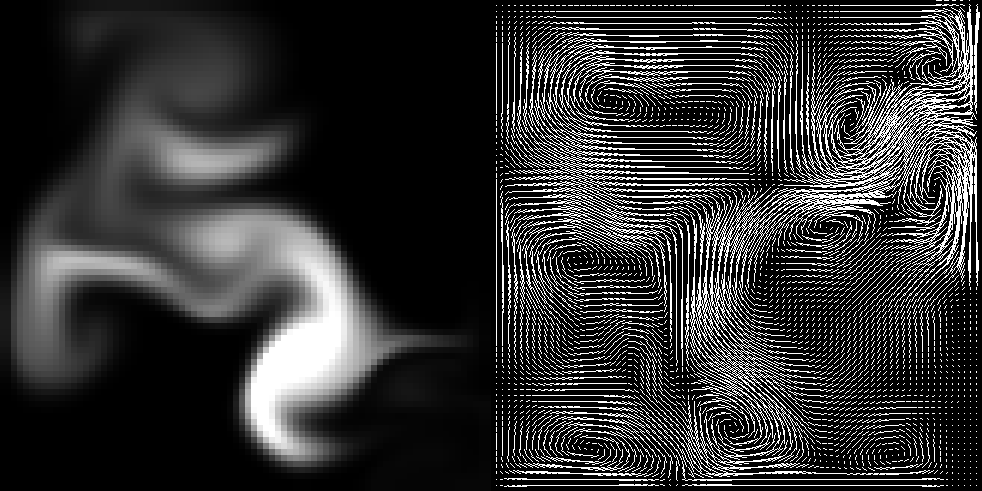

# fluid-dynamics
A java implementation of a Navier-Stokes equation solver.
  

  
An Eulerian incompressible fluid solver using an implementation of the Navier-Stokes equations with a fixed epoch.
This involves creating a grid where each cell represents an average of the properties an incompressible fluid may have. The density of the fluid is transported across a vector field through advection.
